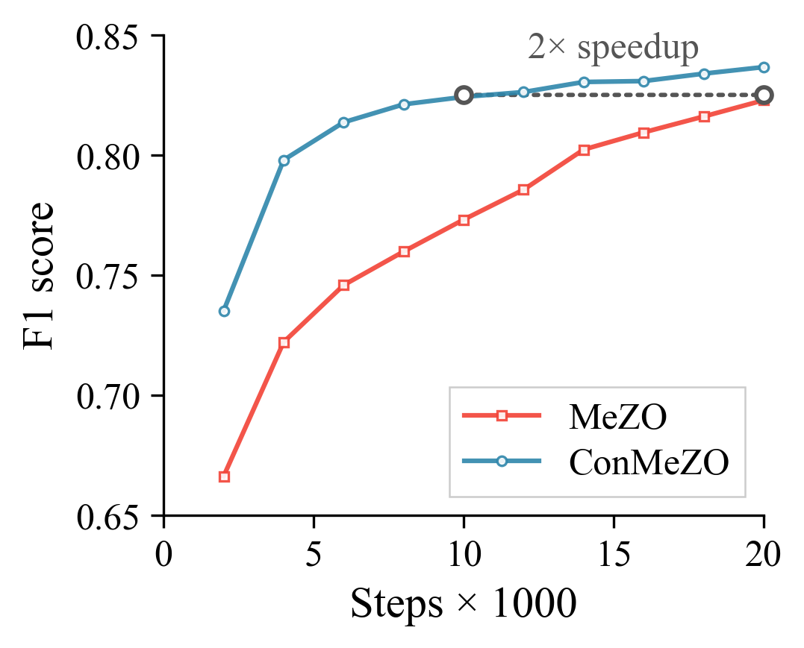
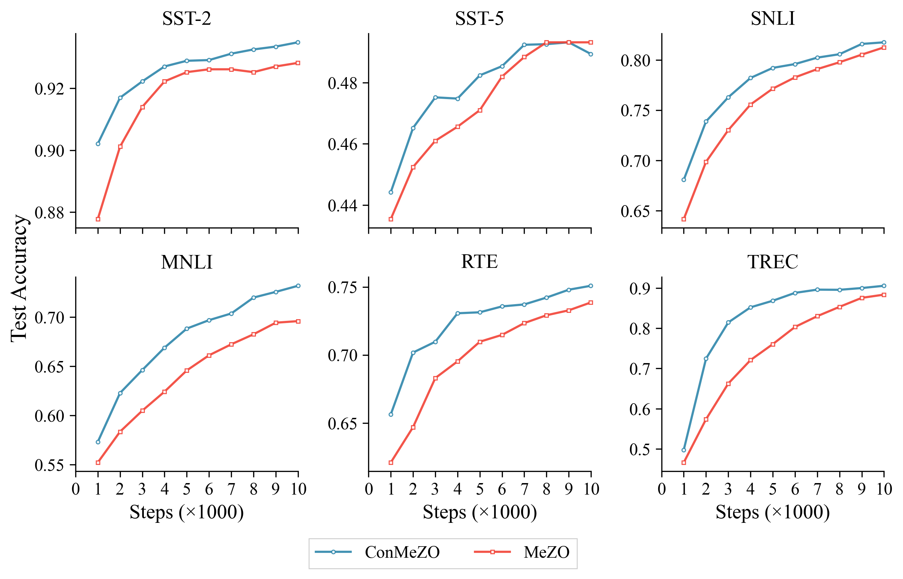

# ConMeZO: Adaptive Descent-Direction Sampling for Gradient-Free Finetuning of Large Language Models

[](https://opensource.org/licenses/MIT)
[](https://aistats.org)

Official code repository for:

> **ConMeZO: Adaptive Descent-Direction Sampling for Gradient-Free Finetuning of Large Language Models**
>
> Lejs Deen Behric, Liang Zhang, Bingcong Li, Kiran Koshy Thekumparampil
>
> *AISTATS 2026*

## Overview

Zeroth-order (ZO) methods like [MeZO](https://github.com/princeton-nlp/MeZO) estimate gradients by perturbing parameters along random directions. In high-dimensional LLM parameter spaces, most random directions are nearly orthogonal to the true gradient, leading to high-variance estimates and slow convergence.

**ConMeZO** addresses this by restricting perturbations to a **cone** centered around a momentum vector that tracks the gradient direction. This reduces the variance of gradient estimates while preserving the memory efficiency of ZO methods.

## Key Results

**Convergence speedup.** ConMeZO achieves up to **2× fewer iterations** to match MeZO's final performance across benchmarks.


<p align="center">
  
</p>
<p align="center"><em>ConMeZO reaches MeZO's final accuracy in half the iterations when fine-tuning OPT-1.3B on SQuAD.</em></p>


**Higher final accuracy.** Averaged over tasks, ConMeZO consistently outperforms MeZO:

| Model | MeZO | ConMeZO |
|:---|:---:|:---:|
| RoBERTa-large (6 tasks) | 75.8% | **77.1%** |
| OPT-1.3B (8 tasks) | 61.3% | **61.8%** |
| OPT-13B (7 tasks) | 71.8% | **72.5%** |

**Minimal memory overhead.** ConMeZO stores one extra momentum buffer — a fraction of what first-order methods require:

| Method | RoBERTa-large | OPT-1.3B |
|:---|:---:|:---:|
| MeZO | 2,178 MiB | 8,983 MiB |
| ConMeZO | 3,343 MiB | 11,493 MiB |
| AdamW | 15,820 MiB | 88,096 MiB |

**Faster wall-clock time per step.** Thanks to a vectorized implementation that leverages the momentum buffer, ConMeZO is ~4–8% faster per iteration than MeZO despite its richer update rule.

**Outperforms recent ZO methods.** ConMeZO matches or exceeds HiZOO, LOZO, MeZO-SVRG, and ZO-AdaMM under comparable compute budgets — and its cone-sampling approach is orthogonal to these methods, opening the door to hybrid approaches.

<p align="center">
  
</p>
<p align="center"><em>Test accuracy over 10K iterations across six GLUE tasks fine-tuning RoBERTa-large.</em></p>

## Repository Structure

```
ConMeZO/
├── opt/                    # Experiments on OPT
│   ├── src/                # Core source code (trainers, metrics, etc.)
│   └── examples/           # Example shell scripts
├── roberta/                # Experiments on RoBERTa-large
│   ├── src/                # Core source code (trainers, dataset, etc.)
│   └── examples/           # Example shell scripts
├── synthetic-experiment/   # Synthetic quadratic benchmark (MeZO vs ConMeZO)
├── assets/                 # Figures for README
├── environments.yml        # Conda environment specification
├── LICENSE
└── README.md
```

## Installation

We provide `environments.yml` for setting up the conda environment:

```bash
conda env create -f environments.yml
conda activate conmezo
```

## Usage

We provide experiments on two model families as well as a lightweight synthetic benchmark. Each sub-directory has its own README with instructions and example scripts:

- **[roberta/](roberta/)** — ConMeZO and MeZO on RoBERTa-large (see [roberta/README.md](roberta/README.md))
- **[opt/](opt/)** — ConMeZO and MeZO on OPT-1.3B / OPT-13B (see [opt/README.md](opt/README.md))
- **[synthetic-experiment/](synthetic-experiment/)** — Synthetic quadratic benchmark comparing MeZO and ConMeZO (see [synthetic-experiment/README.md](synthetic-experiment/README.md))

## Citation

If you find this work useful, please cite our paper:

```bibtex
@inproceedings{behric2026conmezo,
  title={ConMeZO: Adaptive Descent-Direction Sampling for Gradient-Free Finetuning of Large Language Models},
  author={Behric, Lejs Deen and Zhang, Liang and Li, Bingcong and Thekumparampil, Kiran Koshy},
  booktitle={Proceedings of the 29th International Conference on Artificial Intelligence and Statistics (AISTATS)},
  year={2026}
}
```

## Acknowledgments

Our implementation is based on the [DPZero](https://github.com/Liang137/DPZero) repository.

## License

This project is licensed under the MIT License — see the [LICENSE](LICENSE) file for details.